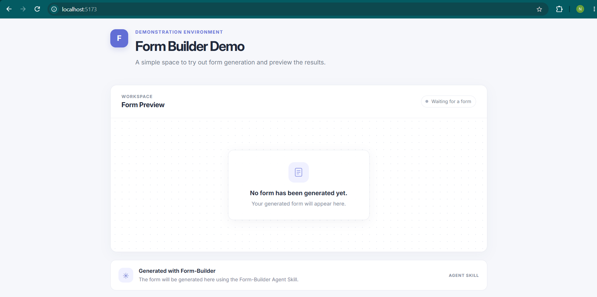
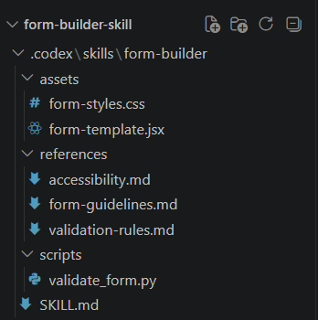
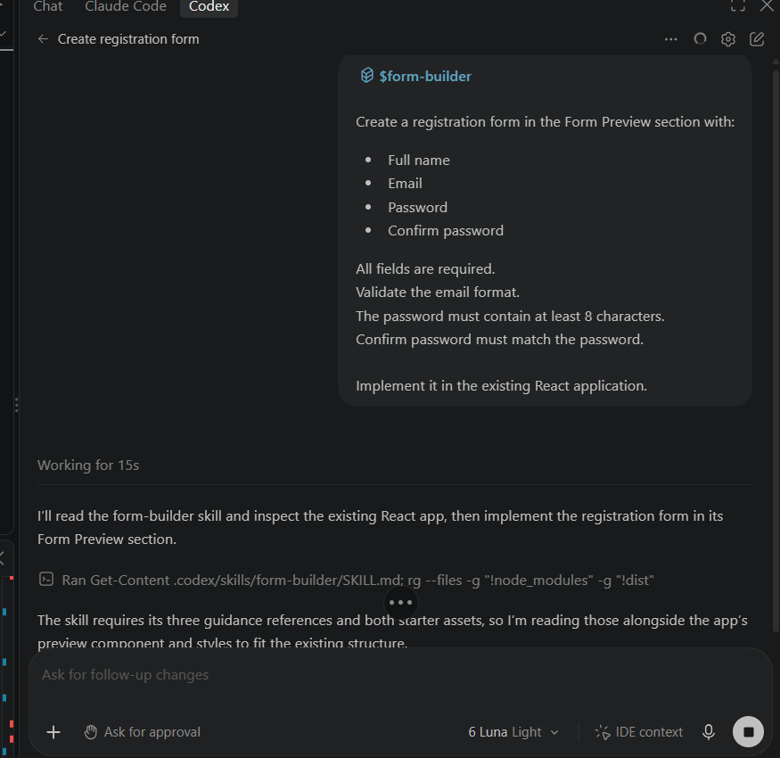
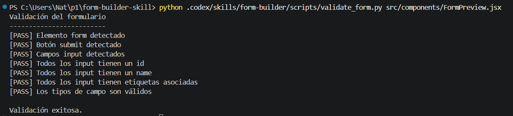
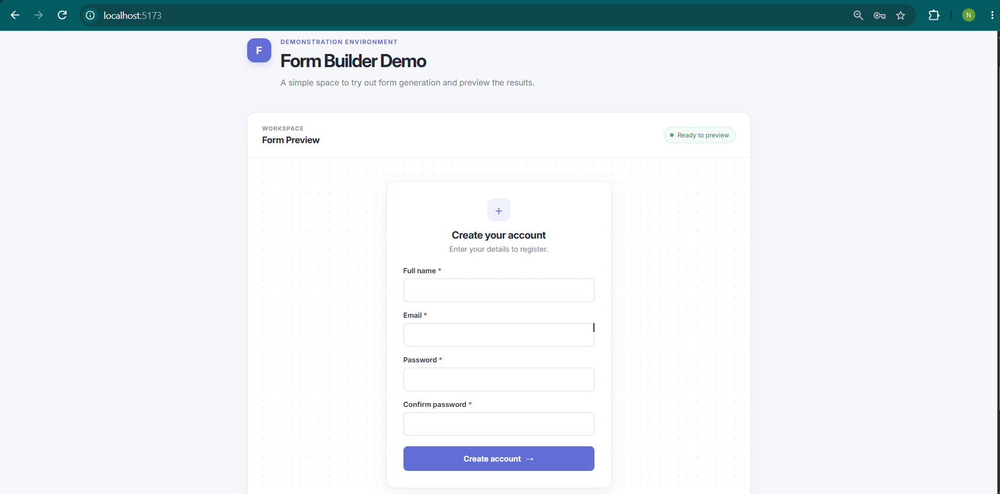
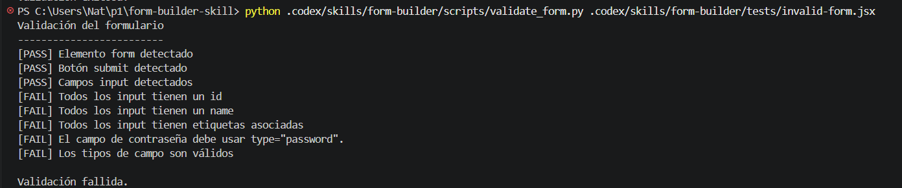

# Form-Builder Agent Skill

## Descripción

Form-Builder es una Agent Skill creada para generar formularios React accesibles, responsivos y validados a partir de los requisitos del usuario. El repositorio también contiene una aplicación React + Vite para demostrar el funcionamiento de la skill.

La aplicación actual muestra un formulario de registro en la sección Form Preview. En `docs/evidencias/` se conservan capturas del estado inicial vacío y del formulario generado.

## Características

- Generación de formularios React a partir de solicitudes del usuario.
- Reglas para validar campos y datos.
- Pautas de accesibilidad para formularios.
- Assets JSX y CSS reutilizables como base para nuevos formularios.
- Validación automática mediante `validate_form.py`.
- Detección de errores comunes, como inputs sin `id`, `name` o label asociado, y tipos incorrectos en campos de correo o contraseña.

## Requisitos

- Node.js
- npm
- Python 3
- Codex con soporte para Agent Skills

## Instalación

Clona el repositorio, instala sus dependencias e inicia la aplicación de demostración:

```sh
git clone <URL-DEL-REPOSITORIO>
cd form-builder-skill
npm install
npm run dev
```

Abre en el navegador la URL local que muestre Vite.

## Estructura de la skill

La skill está ubicada en `.codex/skills/form-builder/`:

```text
.codex/skills/form-builder/
├── SKILL.md
├── scripts/
│   └── validate_form.py
├── assets/
│   ├── form-template.jsx
│   └── form-styles.css
├── references/
│   ├── form-guidelines.md
│   ├── validation-rules.md
│   └── accessibility.md
└── tests/
    └── invalid-form.jsx
```

- `SKILL.md`: define el flujo de trabajo obligatorio de Form-Builder.
- `scripts/validate_form.py`: realiza comprobaciones deterministas básicas sobre el formulario de un componente JSX.
- `assets/form-template.jsx`: plantilla React genérica con un campo etiquetado, espacio para errores y botón submit.
- `assets/form-styles.css`: estilos CSS reutilizables para formularios, incluidos estados de foco y diseño responsivo.
- `references/form-guidelines.md`: reúne pautas generales de diseño de formularios.
- `references/validation-rules.md`: documenta reglas de campos, validación y envío.
- `references/accessibility.md`: documenta prácticas de accesibilidad para formularios.
- `tests/invalid-form.jsx`: fixture intencionalmente incorrecto para demostrar la detección de errores.

La aplicación React + Vite tiene su punto de entrada en `src/main.jsx`, la página en `src/App.jsx`, el componente de vista previa en `src/components/FormPreview.jsx` y los estilos en `src/styles.css`.

## Cómo funciona

```text
Solicitud del usuario
→ Form-Builder
→ Consulta references
→ Utiliza assets
→ Genera o modifica el formulario React
→ Ejecuta validate_form.py
→ Corrige problemas si existen
→ Entrega el formulario validado
```

Los archivos de `references/`, `assets/` y `scripts/` se utilizan realmente durante este flujo: las referencias guían la implementación, los assets proporcionan una base adaptable y el script comprueba el resultado. No son archivos decorativos.

## Uso

En Codex con soporte para Agent Skills, invoca la skill explícitamente con `$form-builder` y describe el formulario solicitado. Por ejemplo:

```text
$form-builder

Crea un formulario de registro en la sección Form Preview con:

- Nombre completo
- Correo electrónico
- Contraseña
- Confirmación de contraseña

Todos los campos son obligatorios.
Valida el formato del correo electrónico.
La contraseña debe tener un mínimo de 8 caracteres.
La confirmación debe coincidir con la contraseña.

Impleméntalo en la aplicación React existente.
```

## Resultado esperado

Form-Builder debe generar el formulario solicitado dentro de la aplicación, con los cuatro campos y sus validaciones. Después debe ejecutar `validate_form.py` sobre el componente JSX y corregir los problemas detectados hasta que la validación pase o exista un impedimento que no pueda resolverse de forma segura.

La versión actual de `src/components/FormPreview.jsx` ya contiene el ejemplo de registro, con validación de campos obligatorios, formato de correo, longitud mínima de contraseña y coincidencia de contraseñas, además de mensajes de error y confirmación.

## Prueba exitosa

Desde la raíz del repositorio, valida el formulario actual:

```sh
python .codex/skills/form-builder/scripts/validate_form.py src/components/FormPreview.jsx
```

La ejecución correcta muestra comprobaciones `[PASS]` y termina con:

```text
Validación exitosa.
```

## Prueba de error

`.codex/skills/form-builder/tests/invalid-form.jsx` es un formulario incorrecto creado intencionalmente para comprobar el manejo de errores. Ejecuta:

```sh
python .codex/skills/form-builder/scripts/validate_form.py .codex/skills/form-builder/tests/invalid-form.jsx
```

El script debe detectar los errores, mostrar resultados `[FAIL]` y terminar con:

```text
Validación fallida.
```

Este fallo es intencional y demuestra que el validador detecta formularios incorrectos; no representa un error en la aplicación.

## Demostración

1. Muestra el estado inicial vacío de Form Preview usando la evidencia `01-app-inicial.png`. La aplicación actual ya contiene el formulario generado, por lo que esta captura documenta el estado anterior a su generación.
2. Invoca `$form-builder` desde Codex.
3. Solicita el formulario de registro del ejemplo.
4. Muestra cómo Codex utiliza la skill, sus `references/` y sus `assets/`.
5. Muestra el formulario generado en el navegador.
6. Ejecuta la prueba exitosa sobre `src/components/FormPreview.jsx`.
7. Ejecuta la prueba de error sobre `tests/invalid-form.jsx`.

## Evidencias

Las siguientes capturas muestran las etapas principales de la demostración, en orden:

### Estado inicial de la aplicación

La aplicación muestra Form Preview vacío antes de generar el formulario.



### Estructura de la Agent Skill

La captura muestra los archivos principales de la skill: `SKILL.md`, `scripts`, `assets` y `references`.



### Ejecución de Form-Builder en Codex

Se muestra la invocación explícita de la skill mediante `$form-builder` y su uso por parte de Codex.



### Validación exitosa

El validador se ejecuta sobre el formulario generado y termina con «Validación exitosa.»



### Formulario generado

El formulario de registro aparece en Form Preview dentro de la aplicación.



### Detección de un formulario inválido

El validador muestra resultados `[FAIL]` para el fixture incorrecto y termina con «Validación fallida.» Este error es intencional.



## Propósito del proyecto

Este proyecto educativo demuestra un flujo completo de Agent Skill mediante `SKILL.md`, `scripts`, `assets`, `references`, una aplicación funcional y manejo de errores.
